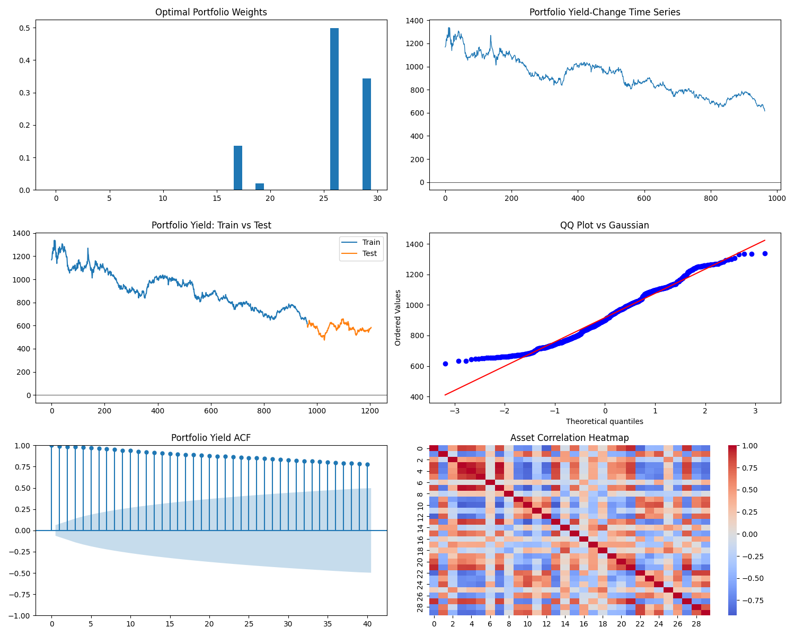
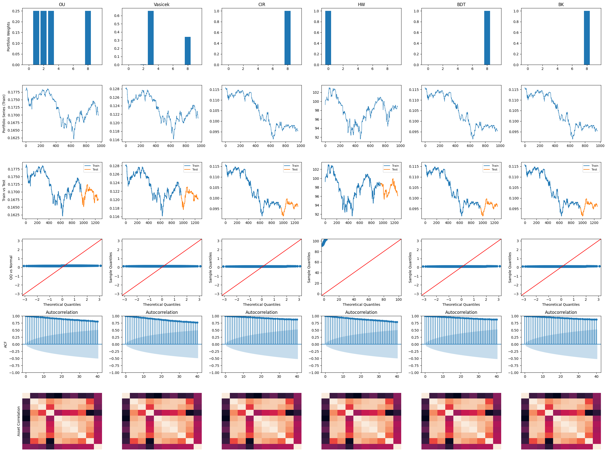

# penalized_ll_and_weight_optims_in_finance
### Preliminaries
This rep is a personal project, for an implementation of a penalized log likelihood and weight optimizations in finance and diffusion models. The main idea is inspired by [Zhang,  Leung, and Aravkin (2020)](https://papers.ssrn.com/sol3/papers.cfm?abstract_id=3252777). The complete top-to-bottom code is via the the ipynb file of [Penalized_LL_and_Diffusion_Models_for_Finance(4).ipynb](https://github.com/glvn5150/penalized_ll_and_weight_optims_in_finance/blob/7ef488b35aa1f84461d41885bc90d253f2c3bdc2/Penalized_LL_and_Diffusion_Models_for_Finance%20(4).ipynb), and also the summary PDF for the mathematical derivations is via [Math Summary - Sparse Mean-Reverting Portfolios via Penalized Likelihood Optimization.pdf](https://github.com/glvn5150/penalized_ll_and_weight_optims_in_finance/blob/8edd19893a389ecbc84c77dd5b19277e35140db7/Math%20Summary%20-%20Sparse%20Mean-Reverting%20Portfolios%20via%20Penalized%20Likelihood%20Optimization.pdf).We start with an asset price series stack as $S \in \mathbb{R}^{(T+1)\times m}$, and a linear portofolio of $x_t = S_t^\top w$. The original paper uses an Ornstein-Uhlenbeck process (OU) in which the equation is:
```math
dx_t = \mu(\theta - x_t)\,dt + \sigma\,dB_t ,
```
where $\mu$ is the mean reversion speed, $\theta$ is long-run equilibirum, $\sigma$ is diffusion volatility. The discrete version has for
```math
x_t = c\,x_{t-1} + (1-c)\theta + \varepsilon_t \quad,\quad \varepsilon_t \sim \mathcal{N}(0, a),
```
with reparameterization according to the paper:
```math
c = e^{-\mu\Delta t}, \qquad a = \frac{\sigma^2(1-e^{-2\mu\Delta t})}{2\mu} \approx \sigma^2\Delta t
```
The paper defines:
```math
A(c) = S_{1:T} - c S_{0:T-1}
```
So that:
```math
\mathcal{L}(w,a,c,\theta) = \frac{1}{2}\ln a + \frac{1}{2Ta}\left\| A(c)w - \theta(1-c)\mathbf{1} \right\|^2
```
The portofolio is normalized with $\|w\|_1 = 1$, by which enforces self-financing upon long/short portofolios. The sparsity or $l_0$ constraint has also condition of $\|w\|_0 \le \eta$. In the paper, a penalty constant is added via $\gamma c$, since when $c$ decreases, $\mu$ increases as it explicitly trades the likelihood fit for speed of mean reversions. The final optimization problem becomes:
```math
\min_{a,c,\theta,w} \; \frac{1}{2} \ln a + \frac{\|A(c)w - \theta(1-c)\mathbf{1}\|^2}{2Ta} + \gamma c \quad \text{s.t} \quad \|w\|_1 = 1, \|w\|_0 \le \eta
```
The paper also eliminates nuisance parameters via partial minimization:
```math
f_3(w) = \min_{a,c,\theta} \mathcal{L}(w,a,c,\theta)
```
Basically the flow in a nuthsell is like:
```math
\arg \min_\theta f(\cdot) \rightarrow \arg \min_{c, \theta} f(\cdot) \rightarrow \arg \min_{a, c, \theta} f(\cdot) \rightarrow f_3(w)
```
The result is thus $\min_{w \in \mathcal{W}} f_3(w)$ where $\mathcal{W}= \left\\{ \|w\|_1=1,\|w\|_0\le\eta \right\\}$. The paper's algorithm core is via:
```math
\Pi_{\mathcal{W}}(x) = \text{sign}(x) \odot \Pi_{\Delta_1 \cap \|·\|_0 \le \eta}(|x|)
```
The algorithm starts by sorting the weights , keep the top $\eta$, project into the simplex, and restore the signs. The clean code is in [test_with_yahoo_finance](clean_code_in_pycharm/test_with_yahoo_finance.py), where I applied it to Indonesian stocks via YahooFinance. 

The figure below shows the diagnostics, in which only 4 portofolios have non zero weights. The dominant ones are around 50% and 35% and other small ones that sums up to 1. This shows the $l_0$ sparsity doing its job, so that it basically selects a minimal subset of assets that best supports an OU-like dynamic. The porto-yield change time series also has a persistent downward drift using the previous findings of the algorithm finding the best mean-reverting combination. 

The train splits shows that it has a strong downward drift for the training period, and a lower level in the test period with mild fluctuations. This means that the portofolio yield ACF has extemely high persistence in which shown in the ACF plot, and the OU-style decays slowly. The mean reversion here is kinda weak, and almost non-existent, and the penalization wasn't strong enough to overcome the data's trend structure. The correlation heatmap shows strong correlation clusters, and the algorithm selects assets from one correlated block and not across blocks, which explains why only few assets carry the entire factor.



### Interest Rate - Indonesian Bond Yields
The next application is to Indonesian Bond Yields. The model is based observed yield and index series as stochastic state variables. So the analysis is statistical rather than arbitrage-free, and dosen't impose self-financing or replication constraints. The Bond yields are sampled from sovereign instruments, FR-series and much more. The time index is $dt = 1/252$ trading days. Some of the data has some bond prices instead, and to make it the same across all, the ones with prices are converted to yields via $y_i(t) = -\frac{1}{T_i} \log\ \left(\frac{P_i(t)}{100}\right)$. Define a yield vector as:
```math
\mathbf{y}(t) =
\begin{bmatrix}
y_1(t) \\
y_2(t) \\
\vdots \\
y_d(t)
\end{bmatrix}
\in \mathbb{R}^d
```
The figure below plots bond yields normalized:


The incremental dynamics is via $\mathbf{Z}_t \;\equiv\; \Delta \mathbf{y}(t) = \mathbf{y}(t) - \mathbf{y}(t-1)$. The weights are thus:
```math
X_t \equiv \mathbf{w}^\top \mathbf{Z}_t = \sum_{i=1}^d w_i \, Z_{i,t}
```
The general framework for the likelihood is:
```math
\min_{w,\vartheta} \mathcal{L}(x(w);\vartheta) + \gamma c \quad \text{s.t.} \quad w \in \mathcal{W}
```
Where $\vartheta$ is a general parameter. The figure below shows the results for the yields. The results of the time series in the Train-Test section is different due to not only difference in data, but also that that since OU partial minimzition assumes the same transition law in the train and test set, stocks have more volatility regimes shift while bonds have slower functions (Central Bank could also be a part of a slow reaction and other Macro-economic / structural multi-factors).


### Other Models and Limitations
The project's derivation and code is limited to only OU spesific regimes and also using Normal Distribution probability. For example, the Vasicek has roots:
```math
\mathcal{L}_{\text{Vasicek}} = \frac{1}{2} \log a + \frac{1}{2Ta} \sum_t (r_t - c r_{t-1} - (1-c) \theta)^2 + \gamma c,
```
with $r_t = c r_{t-1} + (1-c)\theta + \varepsilon_t$ discrete prcoess (which is not that a whole different to the OU prcoess). The CIR has $r_t = c r_{t-1} + (1-c)\theta + \sigma\sqrt{r_{t-1}}\varepsilon_t$ and conditional loglikelihood via the square root of interest upon :
```math
\mathcal{L}_{CIR} = \frac{1}{T}\sum_t \ell_{\chi^2}(r_t \mid r_{t-1};a,c,\theta) + \gamma c . 
```
The CIR's root as well as the other models that I've included also will resist the OU regime. The figure below is the result if the OU is imposed. The figure below shows what happens if one tries to impose a modelling condition to an OU likelihood. 


### Conclusion:
The method works as intended, in which it extracts sparse latent factors via likelihood, but needs more extension to include the math for other models other than an OU regime. 
